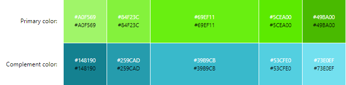
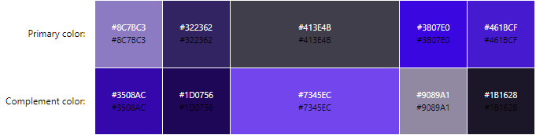

# STAKEHOLDERS
## Customers - 
+ Product info: this is a website for selling mobile devices i.e. phones.
+ It needs to be easily accessible i.e. clear colour schemes for people with visual impairments.
+ Must be a simple layout so not to confuse viewers trying to find a product.
+ Must be quick to load such as using sprites instead of whole images, and only using elements where necessary. 
## Owners - 
+ Needs to be visually appealing to catch the attention of viewers.
+ Must be a professioanl style layout such as no goofy images or text styles.
+ Must be finacially viable and generate an income.
+ Must be cheap to operate (running costs must be lower than profit generated)

## Developers/Me - 
+ Must be well documented, show what has been done.
+ Must be maintainable.
+ Must be easy to test, make a list of what needs testing.
+ Must have design standards, dont cheap out on specific sections.
+ Must be fast to load.

# Colour Schemes

## 1st Design -

CODES:
+ .color-primary-0 { color: #69EF11 }
+ .color-primary-1 { color: #A0F569 }
+ .color-primary-2 { color: #84F23C }
+ .color-primary-3 { color: #5CEA00 }
+ .color-primary-4 { color: #49BA00 }

+ .color-complement-0 { color: #39B9CB }
+ .color-complement-1 { color: #148190 }
+ .color-complement-2 { color: #259CAD }
+ .color-complement-3 { color: #53CFE0 }
+ .color-complement-4 { color: #73E0EF }

REASON: I chosen this colour scheme, because fits with my logo & colour text, plus it's help people to read and understand even for people who have colour blindness.

## 2nd Design -

CODES:
+ .color-primary-0 { color: #413E4B }
+ .color-primary-1 { color: #8C7BC3 }
+ .color-primary-2 { color: #322362 }
+ .color-primary-3 { color: #3B07E0 }
+ .color-primary-4 { color: #461BCF }

+ .color-complement-0 { color: #7345EC }
+ .color-complement-1 { color: #3508AC }
+ .color-complement-2 { color: #1D0756 }
+ .color-complement-3 { color: #9089A1 }
+ .color-complement-4 { color: #1B1628 }

REASON: I chosen this colour scheme, because I like purple colour, and fits with my logo, plus dark colour website will make spooky for the helloween or harvest events.

### PEERS STATEMENT - 
 + Adam : i quite like design 1 as that to me suits the vibe of the website more then design 2

### FINAL DECISION
 My final decision is using Design 1 because as I said it fits with my logo that I created, with colour text (Colour Text is going be *black*), and I will use #53CFE0 for my main & other pages as a BACKGROUND, for boxes I will use #259CAD, inside the boxes there's going be another boxe(s) I will use **GREY** colour, for bottom & top I will use #5CEA00 and very bottom one where's going be a copyright name I will use **DARK GREY** colour.
